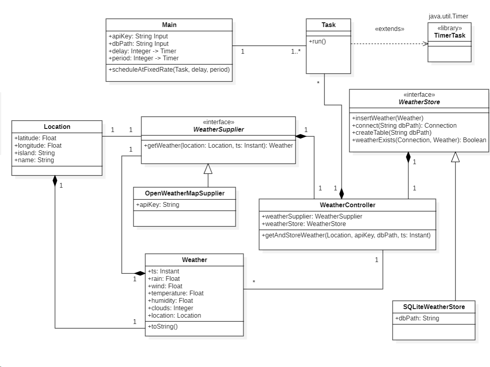

# Weather Forecast - REST API
This code was originally made for the subject of DACD (*Applications Development for Data Science*); taught in the Degree
of Data Science and Engineering, at University of Las Palmas de Gran Canaria (ULPGC), Spain.

## Main purpose & functionality
Java program made for extracting weather information from a REST Api through the page **OpenWeather**. \
[*Link to page*](https://openweathermap.org)  
<a name="openweather"></a>


This code, specifically, consists on making an API call every 6 hours for fetching the already registered locations of the **weather forecast** for the next 5 days at 12:00 local time. These locations are punctual chosen ones for each of the 8 islands that constitue the Chinijo Archipielago (Canary Islands).


## Execution

For the execution of the code, you will first need to be in the **Main.java** class: (```src/main/java/marrero_ferrera_gcid_ulpgc/test/control/Main.java```). \
After that, you can freely start debugging and run de code, and it will ask for an **API Key** and the **database name and path**.


In the following line, you will have an example suitable API Key for making the call to the REST Api, and a simple path to create the database: \
\
Suitable free API Key: ```3c3aea5ce433b076c2f83b0c608896d8``` \
Example of the database name: ```weatherDataBase``` 


**Disclaimers:**
- You can select your database name and path; however, **table name** and **table attributes** are fixed in code and can not be changed. _(Table called weatherDataBase with 11 attributes)._
- The provided **API Key** is just an example free one created to ease the process of execution. By now, the [terms of the free plan](https://home.openweathermap.org/subscriptions) admit up to 1,000 calls per day to the same API (which is difficult to exceed).

# Resources
1. This project was fully made on **[IntelliJ IDEA](https://www.jetbrains.com/es-es/idea/)**, by **JetBrains**. Besides, the project structure is based on the same software's default
settings, with a **Maven** file for the needed dependencies. **[More information below](#design-)**.


2. The version control tool used is **Git**, and published on a **GitHub Repository**. As you may see, there is just one existing branch in the building process of the code, due to its relatively low time of development and its linearity. This allows us to follow an easy and precise path on the _"making of"_ of the project.


3. Finally, this document has been made as a **Markdown** file, provided by the base **IntelliJ** software.   
The information needed for the development of the project has been taken from many sources. The main ones are the resource ones like [SQLite](https://www.sqlite.org/index.html) and [Maven Repository](https://mvnrepository.com) for the database and the dependencies respectively. Additionally, subject uploaded support files, [Stack Overflow](https://www.google.com/url?sa=t&rct=j&q=&esrc=s&source=web&cd=&cad=rja&uact=8&ved=2ahUKEwia3r6cxsiCAxW5V6QEHd52AF0QFnoECA8QAQ&url=https%3A%2F%2Fstackoverflow.com%2F&usg=AOvVaw0C-i47dSU_h02E_IQoAztO&opi=89978449), [YouTube](https://www.youtube.com/) and [ChatGPT](https://chat.openai.com) have been of extreme help for syntax problems and questions.

# Design 

This project consists on the default settings of **IntelliJ IDEA**, with a **Maven** file for dependencies. The current root structure of the **source code** is the following: `src/main/java/marrero_ferrera_gcid_ulpgc/test`.  
After that, the program is divided into two modules:
1. `model`: with the code java classes and interfaces that make all the work (consulting API, creating the objects, storing them, etc.). Contains the **classes**: `Weather`, `Location`, `WeatherController` and **interfaces**: `WeatherStore` and `WeatherSupplier` with their own generalizations of classes: `SQLiteWeatherStore` and `OpenWeatherMapSupplier`.
2. `control`: first, with the `Main` class and, additionally, the `Task` class which is just an extension of the first one used to automatize the procedural and scheduled call to the API.

\
Here we have a graphical explanation to define the relationship between classes and interfaces, made with the [StarUML software](https://staruml.io/download/):     



---

### License and state of the project
_This code is **FREE TO USE** and has no protection of License._   
This code is finished, but it can be freely modified and copied for particular usage; just follow [OpenWeatherMap](#main-purpose--functionality) policies.
